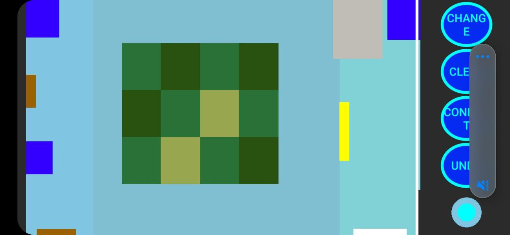

# Target_Setter_v1

## Packages

This project has 2 packages:

- Target_Setter app
- r2_src (src files for Robot R2 2024)

---

## Features

---

### Target_Setter App

- Changing game field mode (for both the 2026 gamefield red and blue team, and the small gamefield)
- Waypoints display to control robot's position
- Virtual joystick for controlling robot's orientation
- Undo and Clear all the waypoints
- Waypoints can be added up to 27 waypoints
- Sending and receiving positions and orientation (in quaternion) to robot via UDP

---

### r2_src

- Moving based on data from Target_Setter app
- Receiving and sending odometry from app and to app
- Auto-detecting app's IP address using `/target_info` topic
- Lock robot only to receive data from one source and terminate connection if no data is received within 15 minutes
- New custom message `TargetSetter` for topic `target_info`
- UDP can receive data up to 64kB
- Sending data to app at 10Hz
- The port of the UDP socket for binding with the app is set to 5050

---

## How it works

---

### Target_Setter app


---

### r2_src

!

---

## Configuration

- copy `r2_src` into your workspace, rename it to `src`
- Then build the packages

``` bash
colcon build
```

- Install the provided `.apk` file on your android phone (if it asks you to scan, don't scan, just proceed to installation directly)

---

## How to operate

- after building the workspace, source your workspace, then run all the packages
- on the app, input the IP address of the robot, and set the port to 5050
- click on the gamefield to set waypoint (click Change button if you wish to change the gamefield, it will handle the dimension automatically)
- if the robot terminates the connection, you have to bind again

---

## how to use the app



- To add waypoint click on the gamefield
- The Change button is for changing gamefield
- Undo button deletes the last waypoint
- Clear button deletes all waypoint
- Connect button is UDP bridge, allowing robot to bind with app
- The circle under Undo button is a virtual joystick for controlling orientation

---

## Limitations

- The odometry (`current_odometry`) is off by a few centimeters, and the orientation is also off by a few radians
- The app can't handle too high frequency, it will lag
- There's no launch file for this version
- Full screen mode only works on Android 11+

> Remark: this app was first written by b Lythong, but it was never used on robots due to wrong odometry being published from the app. # Target_Setter_v1

## Packages

This project has 2 packages:

- Target_Setter app
- r2_src (src files for Robot R2 2024)

---

## Features

---

### Target_Setter App

- Changing game field mode (for both the 2026 gamefield red and blue team, and the small gamefield)
- Waypoints display to control robot's position
- Virtual joystick for controlling robot's orientation
- Undo and Clear all the waypoints
- Waypoints can be added up to 27 waypoints
- Sending and receiving positions and orientation (in quaternion) to robot via UDP

---

### r2_src

- Moving based on data from Target_Setter app
- Receiving and sending odometry from app and to app
- Auto-detecting app's IP address using `/target_info` topic
- Lock robot only to receive data from one source and terminate connection if no data is received within 15 minutes
- New custom message `TargetSetter` for topic `target_info`
- UDP can receive data up to 64kB
- Sending data to app at 10Hz
- The port of the UDP socket for binding with the app is set to 5050

---

## How it works

---

### Target_Setter app


---

### r2_src

!

---

## Configuration

- copy `r2_src` into your workspace, rename it to `src`
- Then build the packages

``` bash
colcon build
```

- Install the provided `.apk` file on your android phone (if it asks you to scan, don't scan, just proceed to installation directly)

---

## How to operate

- after building the workspace, source your workspace, then run all the packages
- on the app, input the IP address of the robot, and set the port to 5050
- click on the gamefield to set waypoint (click Change button if you wish to change the gamefield, it will handle the dimension automatically)
- if the robot terminates the connection, you have to bind again

---

## how to use the app


- To add waypoint click on the gamefield
- The Change button is for changing gamefield
- Undo button deletes the last waypoint
- Clear button deletes all waypoint
- Connect button is UDP bridge, allowing robot to bind with app
- The circle under Undo button is a virtual joystick for controlling orientation

---

## Limitations

- The odometry (`current_odometry`) is off by a few centimeters, and the orientation is also off by a few radians
- The app can't handle too high frequency, it will lag
- There's no launch file for this version
- Full screen mode only works on Android 11+

> Remark: this app was first written by b Lythong, but it was never used on robots due to wrong odometry being published from the app. This version is a rewritten of his app, fixing the target odometry calculation and new UI entirely. However, the odometry from the encoder is still off due to odometry and IMU drifts.
