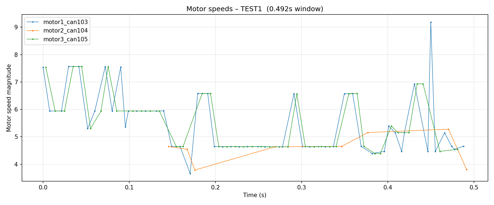
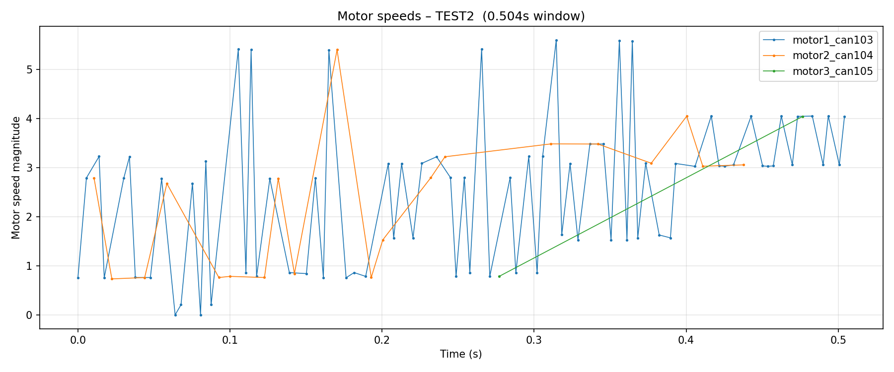
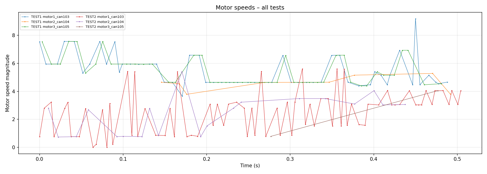

Motor Speed Analysis
====================

Objective
---------
Examine individual motor speed traces to check for:

- **Data completeness** — are all 4 motors (CAN 102–105) reporting speed feedback?
- **Symmetry** — are all motors contributing equally?
- **Saturation** — does any motor hit its maximum and flatten out?
- **Oscillation** — is the speed steady or hunting?

Method
------
Each motor publishes a 4-component speed vector via CAN bus. The speed magnitude
is computed as:

.. math::

   |\mathbf{v}_i| = \sqrt{s_1^2 + s_2^2 + s_3^2 + s_4^2}

The system has 4 motors on CAN IDs 102–105:

.. list-table::
   :header-rows: 1
   :widths: 15 15 35 20 20

   * - CAN ID
     - Motor
     - Speed data in log?
     - TEST1 samples
     - TEST2 samples
   * - 102
     - motor0
     - **No** — ACK only, no speed vector
     - 0
     - 0
   * - 103
     - motor1
     - Yes
     - 53
     - 77
   * - 104
     - motor2
     - Yes
     - 8
     - 20
   * - 105
     - motor3
     - Yes
     - 43
     - 2

.. warning::

   **Motor 0 (CAN 102) is missing from all plots.** The raw log contains
   ``motor id: 0, can id = 102`` acknowledgment lines, confirming the CAN
   message is received, but the ``current_odometry`` node never produces a
   ``motor speed: [...]`` line for it. The CAN frame arrives but is not
   correctly decoded — this is the ``can_id`` conflict.

.. note::

   Motors do not publish at the exact same timestamps. Each motor reports
   independently, so traces appear interleaved and the per-motor sample
   counts are uneven.

TEST1
-----

**Observations:**

- Data is **sparse** — only a handful of bursts over the 0.5 s window.
- **motor1_can103** (blue) dominates with 53 samples: starts at ~7.5, drops,
  then spikes to a **peak of ~9.2** near t = 0.45 s.
- **motor3_can105** (green) tracks motor1 closely when it appears (mean 5.53
  vs 5.48), indicating these two motors are well-matched.
- **motor2_can104** (orange) has only 8 data points and a lower mean of
  **4.56** — approximately 17% slower than motors 1 and 3.

**Per-motor mean speed:**

.. list-table::
   :header-rows: 1
   :widths: 30 20 15

   * - Motor
     - Mean magnitude
     - Samples
   * - motor1_can103
     - 5.48
     - 53
   * - motor2_can104
     - 4.56
     - 8
   * - motor3_can105
     - 5.53
     - 43

TEST2
-----

**Observations:**

- **motor1_can103** (blue) dominates with 77 samples and exhibits heavy
  **oscillation** — speed swings repeatedly between ~0 and ~5.6.
- **motor2_can104** (orange) appears briefly around t = 0.08–0.1 s and
  t = 0.19–0.22 s at low speeds (~0.8). Only 20 samples total.
- **motor3_can105** (green) is nearly absent — only **2 data points** in the
  entire test.
- The oscillatory pattern in motor1 (the primary reporting motor) suggests the
  controller is **hunting**: overshooting the target speed, correcting to near
  zero, then overshooting again.

**Per-motor mean speed:**

.. list-table::
   :header-rows: 1
   :widths: 30 20 15

   * - Motor
     - Mean magnitude
     - Samples
   * - motor1_can103
     - 2.53
     - 77
   * - motor2_can104
     - 2.34
     - 20
   * - motor3_can105
     - 2.42
     - 2

Combined View
-------------

Both tests on a shared timeline showing the transition from higher-speed (TEST1)
to lower-speed with turning (TEST2).

Key Findings
------------

1. **Motor 0 (CAN 102) never reports speed data.** The CAN frame is received
   but ``current_odometry`` fails to decode it. This must be resolved before
   any stability conclusion can be considered complete — the controller is
   operating without feedback from one of four motors.

2. **Motor 2 (CAN 104) reports inconsistently** — 8 samples in TEST1, 20 in
   TEST2. Its mean speed is ~17% lower than motors 1 and 3 in TEST1 (4.56
   vs ~5.5), which contributes to the curved path.

3. **Motor 3 (CAN 105) nearly vanishes in TEST2** — only 2 data points. CAN
   bus contention or message filtering may be dropping its feedback when motor
   commands are more active (turning).

4. **TEST2 shows clear speed oscillation** in motor1 — swinging 0 to 5.6
   repeatedly. This is consistent with an under-damped PID speed loop or
   command latency causing the controller to hunt.

5. **The "overall speed" metric is unreliable** because it averages only the
   motors that reported at each timestamp. With motor0 missing entirely and
   motors 2/3 reporting sparsely, the overall speed is effectively just
   motor1's speed.

.. seealso::

   - :doc:`overall_speed` — aggregated speed stability (with the above caveat)
   - :doc:`yaw_analysis` — yaw rate behaviour resulting from motor asymmetry
   - Raw data: ``test_data/motor_speed/motor_speeds_TEST1.csv``,
     ``test_data/motor_speed/motor_speeds_TEST2.csv``
     
