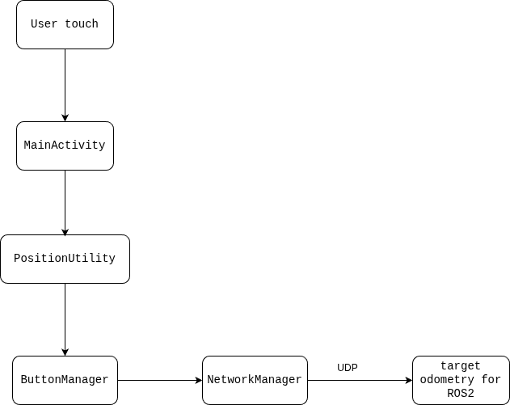
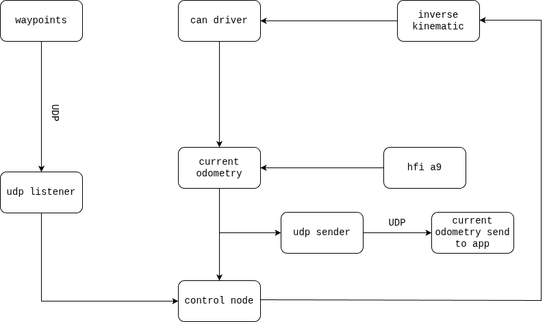

Technical Reference
===================

Architecture
------------

.. image:: ../../img/system_overview.png
   :alt: System Architecture Diagram

Target_Setter app
^^^^^^^^^^^^^^^^^

r2_src
^^^^^^

Waypoint queue and state machine
--------------------------------

Waypoint queue
^^^^^^^^^^^^^^

- **Waypoint queue:** stores received waypoints from `/waypoint`
- **Active target:** currently executing waypoint
- **Visited waypoints:** stack of completed waypoints for return

State machine
-------------

- ``IDLE``: no active target, waiting for waypoint or return command
- ``NAVIGATING``: moving to ``active_target``
- ``EDIT``: active target is being edited
- ``PAUSED``: robot is paused by keyboard or automatic pause
- ``RETURNING``: moving to last visited waypoint (return command)

Communication protocol
----------------------

UDP packet structure
^^^^^^^^^^^^^^^^^^^^

Waypoints packet
~~~~~~~~~~~~~~~~

- **Purpose:** send a list of waypoints for the robot to follow
- **Frequency:** send when pressing Send in the app

**Packet Structure (binary):**

+--------+---------------+----------------------------------+
| Offset | Size (bytes)  | Description                      |
+========+===============+==================================+
| 0      | 4             | Header (0xAA)                    |
+--------+---------------+----------------------------------+
| 4      | 4             | Number of waypoints (counter)    |
+--------+---------------+----------------------------------+
| 8      | 4             | Plan ID (version)                |
+--------+---------------+----------------------------------+
| 12     | 16 * N        | Waypoint (X, Y) in double (8 B)  |
+--------+---------------+----------------------------------+

- N = number of waypoints
- Coordinates are in meters, converted from percentage position
- Byte order: Little Endian

Edit waypoint packet
~~~~~~~~~~~~~~~~~~~~

- **Purpose:** update a previously sent waypoint
- **Frequency:** send when user edits a waypoint via the app

**Packet structure (binary):**

+--------+---------------+--------------------------+
| Offset | Size (bytes)  | Description              |
+========+===============+==========================+
| 0      | 1             | Edited flag (1 = edited) |
+--------+---------------+--------------------------+
| 1      | 4             | Waypoint index (1-based) |
+--------+---------------+--------------------------+
| 5      | 4             | Plan ID                  |
+--------+---------------+--------------------------+
| 9      | 8             | New X coordinate (double)|
+--------+---------------+--------------------------+
| 17     | 8             | New Y coordinate (double)|
+--------+---------------+--------------------------+

Return message packet
~~~~~~~~~~~~~~~~~~~~~

- **Purpose:** send a single boolean signal to the robot
- **Frequency:** send when return button is pressed

**Packet structure (binary):**

+--------+---------------+-----------------------------+
| Offset | Size (bytes)  | Description                 |
+========+===============+=============================+
| 0      | 1             | Edited flag (0=false,1=true)|
+--------+---------------+-----------------------------+

Odometry data reception
~~~~~~~~~~~~~~~~~~~~~~~

- **Purpose:** receives current robot odometry
- **Frequency:** 10Hz

**Packet structure (binary):**

+--------+---------------+-------------------------+
| Offset | Size (bytes)  | Description             |
+========+===============+=========================+
| 0      | 8             | X position (double)     |
+--------+---------------+-------------------------+
| 8      | 8             | Y position (double)     |
+--------+---------------+-------------------------+
| 16     | 8             | Yaw (double, radians)   |
+--------+---------------+-------------------------+

- Byte order: Little Endian
- Latest odometry stored in memory for waypoint calculations

UDP data flow
^^^^^^^^^^^^^

Sending data
~~~~~~~~~~~~

- App uses ``NetworkManager.sendWaypoints()``, ``sendEdit()``, and ``sendMesage()``
- Waypoints are converted to binary packets before sending
- Each send operation is done in a separate thread
- Plan ID differentiates waypoint plans
- Packets sent via UDP to robot IP/port (default 5050)

Receiving data
~~~~~~~~~~~~~~

- Persistent UDP socket listens (``startReceiving(port)``)
- Robot sends odometry at 10Hz (X, Y, Yaw)
- Incoming packets converted using Little Endian byte order
- Latest odometry stored in ``latestOdometry``

Processing data
~~~~~~~~~~~~~~~

When adding waypoint:

- Convert touch position to normalized coordinates
- Compute target X, Y in meters
- Add to waypoint list, update UI
- Send waypoint via UDP

When editing waypoint:

- Specify index and new coordinates
- Update list and redraw UI
- Send edit packet via UDP with plan ID

Return message:

- Single-byte packet sent to trigger return behavior

Odometry:

- Display robot position
- Compute accurate target positions

Coordinate convention and control logic
---------------------------------------

Coordinate flow
^^^^^^^^^^^^^^^

Touch → UI → App → Robot

.. code-block:: text

   Touch Event (screen pixels) 
      ↓ absolutePosition()
   Absolute Coordinates relative to boundaryView
      ↓ normalizedPosition()
   Normalized Coordinates (0–1)
      ↓ percentagePosition()
   Percentage Coordinates (0–100%)
      ↓ targetPosition()
   Global Frame (meters) → UDP → Robot

Robot → App (Odometry)

.. code-block:: text

   Odometry Packet (X, Y, yaw in meters) → inputPosition()
      ↓ metersToPxX/Y
   Pixels on UI → Display robot position

Frame definition
^^^^^^^^^^^^^^^^

Local frame:

- Origin: the center of the robot
- +x: forward
- +y: left
- +yaw: counter-clockwise

Global frame:

- Origin: top-left of the screen on the target_setter app
- +x: rightward on the screen on the target_setter app
- +y: downward on the screen on the target_setter app
- Waypoints that is sent to the robot is in global frame

**Units:**

On the robot and the data sent from app:

- x: meters
- y: meters
- yaw: radians (data from app only send x and y, yaw must be infer from them)
- Vx: m/s
- Vy: m/s
- Wz: rad/s

On the app:

- x: percentage
- y: percentage

Touch input conversion
^^^^^^^^^^^^^^^^^^^^^^

**Absolute position (touch):**

.. code-block:: java

   double absoluteX = rawX - boundaryLeft;
   double absoluteY = rawY - boundaryTop;

- Converts raw screen coordinate to coordinate relative to `boundaryView`
- Clamped to boundary edges

**Normalized position (0-1):**

.. code-block:: java

   double normalizedX = absoluteX / screenWidth;
   double normalizedY = absoluteY / screenHeight;

- Represents position as fraction of the screen

**Percentage position (0-100%):**

.. code-block:: java

   double percentageX = normalizedX * 100.0;
   double percentageY = normalizedY * 100.0;

- Used as intermediate format for calculation into world meters
- Checked against 0-100% boundary

**Global meters (for UDP):**

.. code-block:: java

   double targetX = (percentageX / 100.0) * GAME_FIELD_X;
   double targetY = (percentageY / 100.0) * GAME_FIELD_Y;

- Converts to meters based on field dimension
- Result is sent to robot

**Robot odometry (UI display):**

.. code-block:: java

   double inputX = odometryData[0] * (screenWidth / GAME_FIELD_X);
   double inputY = odometryData[1] * (screenHeight / GAME_FIELD_Y);

- Converts meters to pixels for UI display
- Clamped boundary using `validateBoundary()`

Control logic
-------------

PD controller
^^^^^^^^^^^^^

- **Position errors:**

computed in global frame

.. code-block:: python

   current_x_error_g = self.desired_x - self.current_x
   current_y_error_g = self.desired_y - self.current_y
         
   current_yaw_p_error = self.normalize_angle(self.desired_yaw - self.current_yaw)

- **Derivative errors:**

.. code-block:: python

   current_yaw_d_error = (current_yaw_p_error - self.previous_yaw_p_error)/self.dt
   current_x_d_error = (current_x_error_g - self.previous_x_p_error)/self.dt
   current_y_d_error = (current_y_error_g - self.previous_y_p_error)/self.dt

- **Complementary filtering:**

apply complementary filter on D term to smooth the movement

.. code-block:: python

   current_x_d_error = ALPHA_D * current_x_d_error + (1 - ALPHA_D) * self.previous_x_d_error
   current_y_d_error = ALPHA_D * current_y_d_error + (1 - ALPHA_D) * self.previous_y_d_error
   current_yaw_d_error = ALPHA_D * current_yaw_d_error + (1 - ALPHA_D) * self.previous_yaw_d_error

- **PD controller:**

.. code-block:: python

   linear_vel_x_g = self.k_p_linear * current_x_error_g + self.k_d * current_x_d_error
   linear_vel_y_g = self.k_p_linear * current_y_error_g + self.k_d * current_y_d_error
   angular_vel_z_g = self.k_p_yaw * current_yaw_p_error + self.k_d_yaw * current_yaw_d_error

- **Frame conversion:**

.. code-block:: python

   linear_vel_x_l =  math.cos(self.current_yaw) * current_x_error_g + math.sin(self.current_yaw) * current_y_error_g
   linear_vel_y_l = -math.sin(self.current_yaw) * current_x_error_g + math.cos(self.current_yaw) * current_y_error_g

- Units must match: meters (x, y), radians (yaw), m/s (velocities)
- Linear velocity in robot frame, angular velocity around z-axis
- Low-pass filtering applied on derivative term
- Return `linear_vel_x`, `linear_vel_y`, and `angular_vel_z`

Dead reckoning
^^^^^^^^^^^^^^

If the velocity is less than error threshold, overwrite it with 0

Speed limit
^^^^^^^^^^^

If velocity exceeds maximum speed, overwrite it with maximum speed

Path planning
-------------

Arrivel detection
^^^^^^^^^^^^^^^^^

- Target reached if:
  - Distance < ``goal_tolerance_pos = 0.05m``
  - Remains withitn tolerance for ``0.5s``
- Arrival time accumulated using ``dt`` from timer callback

Waypoint callback
^^^^^^^^^^^^^^^^^

- Store each waypoint in a dictionary
- Append it into the queue
- Copy the waypoint in the queue to ``active_target`` to execute

Waypoints execution
^^^^^^^^^^^^^^^^^^^

- if ``active_target`` does not exist, and there's waypoint in the queue, pop the queue, then reset robot state to go to the waypoint that's being popped
- if return is triggered, and there's visited waypoint, command the robot to go the visited waypoint
- Otherwise, stop the robot

Waypoint update
^^^^^^^^^^^^^^^

- Store the edited waypoint in a dictionary
- If the edited waypoint is active, use complementary to smooth the robot movement when update to prevent jumping suddenly

.. code-block:: python

   self.active_target['x'] = (1 - ALPHA) * self.active_target['x'] + ALPHA * update_wp['updated_x']
   self.active_target['y'] = (1 - ALPHA) * self.active_target['y'] + ALPHA * update_wp['updated_y']

- Otherwise, just update the waypoint as normal

Pause
^^^^^

- Robot pauses motion at each target
- If distance from the robot to the target is less than tolerance, stop the robot
- If the elapsed time during pause exceeds pause duration, command the robot to go to the next waypoint

Return
^^^^^^

- Update the return flag

Odometry handling
-----------------

Frame conversion
^^^^^^^^^^^^^^^^

- Calculate velocity in local frame

.. code-block:: python

   linear_vel_x_local = (self.R/4) * (self.motor_vel[0] + self.motor_vel[1] + self.motor_vel[2] + self.motor_vel[3])
   linear_vel_y_local = (self.R/4) * (-self.motor_vel[0] + self.motor_vel[1] + self.motor_vel[2] - self.motor_vel[3])
   w_z = (self.R * (-self.motor_vel[0] + self.motor_vel[1] - self.motor_vel[2] + self.motor_vel[3]))/(2 * (self.l_x + self.l_y))

- Convert them to global frame

.. code-block:: python

   v_x_global = math.cos(self.current_yaw) * linear_vel_x_local - math.sin(self.current_yaw) * linear_vel_y_local
   v_y_global = math.sin(self.current_yaw) * linear_vel_x_local + math.cos(self.current_yaw) * linear_vel_y_local

- Integrate velocity to get position

.. code-block:: python

   self.x += v_x_global * self.dt 
   self.y += v_y_global * self.dt

Offset
^^^^^^

.. code-block:: python

   self.x_odom = (self.x - self.x_start) - self.frame_offset_x
   self.y_odom = (self.y - self.y_start) - self.frame_offset_y

Yaw
^^^

- Calculate yaw from quaternion

.. code-block:: python

   def calculate_yaw(self, q_x, q_y, q_z, q_w):
      siny_cosp = 2 * (q_w * q_z + q_x * q_y)
      cosy_sinp = 1 - 2 * (q_y**2 + q_z**2)
      return math.atan2(siny_cosp, cosy_sinp)

- Normalize yaw

.. code-block:: python

   def normalize_angle(self, a):
      return math.atan2(math.sin(a), math.cos(a))

- Offset yaw

.. code-block:: python

   self.current_yaw = (self.yaw - self.yaw_start) + 2 * math.pi * self.overflow_counter

- Convert to quaternion to publish

.. code-block:: python

   def publish_yaw(self, yaw):
      q = Quaternion()
      q.w = math.cos(yaw/2)
      q.x = 0.0
      q.y = 0.0
      q.z = math.sin(yaw/2)
      return q

Inverse Kinematic
-----------------

.. code-block:: python

   V_wheel = [
   Vx/self.R - Vy/self.R - omega_z*(self.lx + self.ly)/(2.0*self.R),
   Vx/self.R + Vy/self.R + omega_z*(self.lx + self.ly)/(2.0*self.R),
   Vx/self.R + Vy/self.R - omega_z*(self.lx + self.ly)/(2.0*self.R), 
   Vx/self.R - Vy/self.R + omega_z*(self.lx + self.ly)/(2.0*self.R)
   ]
