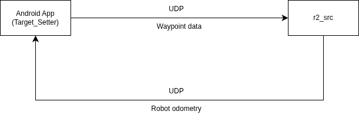

Test and Evaluation
===================

This section presents the test procedures and evaluation results for the waypoint navigation system, covering system integration, navigation accuracy, communication reliability, and identified limitations.

Test Setup
----------

The system was tested in an indoor environment with the following configuration:

- **Robot:** omnidirectional mecanum-wheel mobile robot (0.5 m × 0.5 m)
- **Controller:** Android application (Target Setter) running on a mobile device
- **Communication:** UDP over Wi-Fi (port 5050)
- **ROS2 middleware:** running on NVIDIA Jetson Xavier (Ubuntu 20.04, ROS2 Foxy)
- **Field dimensions:** configurable via the app; tests performed on a known-size floor area

Communication Test
------------------

Objective: verify that waypoints, edit commands, and return signals sent from the app are correctly received and processed by the robot.

Results:

- UDP waypoint packets were received and parsed correctly by the robot when the robot and app were on the same Wi-Fi network
- Edit waypoint packets were successfully applied when the plan ID matched the active plan
- Return signal was received and the robot correctly re-executed navigation toward the previously visited waypoint
- No packet loss was observed at normal sending frequency under typical indoor Wi-Fi conditions

.. note::

   Communication was unreliable when the robot moved beyond the Wi-Fi coverage area or when the network was congested. Packet loss did not cause a crash but could result in missed waypoints.

Navigation Accuracy Test
------------------------

Objective: measure the positional accuracy of the robot when navigating to waypoints specified through the app.

Procedure:

1. Set a waypoint at a known location on the field using the app
2. Command the robot to navigate to the waypoint
3. Measure the final position of the robot relative to the target

Results:

- The robot consistently arrived within approximately **5–10 cm** of the target position under nominal conditions
- Yaw alignment at the final waypoint was typically within **±0.1–0.2 rad** of the desired heading
- Positional error increased when the robot travelled longer distances due to odometry drift
- Arrival detection (``goal_tolerance_pos = 0.05 m``) functioned correctly in most trials; occasional false arrivals were observed when the robot oscillated near the boundary of the tolerance zone

Waypoint Sequence Test
----------------------

Objective: verify that the robot correctly executes a sequence of waypoints in order.

Procedure:

1. Define multiple waypoints (3–5) on the app
2. Send all waypoints at once using the Send button
3. Observe robot navigation from waypoint to waypoint

Results:

- The robot successfully navigated through all waypoints in the defined sequence
- Each waypoint was held for the configured pause duration before proceeding to the next
- The waypoint queue was correctly emptied upon completion of the sequence

Waypoint Editing Test
---------------------

Objective: confirm that live edits to an active waypoint are applied smoothly without causing abrupt robot motion.

Procedure:

1. Command the robot toward an active waypoint
2. Edit the waypoint position using the Edit function in the app while the robot is moving
3. Observe the robot's response

Results:

- The robot smoothly transitioned to the updated target using complementary filtering
- No sudden jumps in robot motion were observed during editing
- The plan ID mechanism correctly prevented stale edit packets from being applied to a new plan

Return Function Test
--------------------

Objective: verify the return-to-previous-waypoint behavior.

Procedure:

1. Navigate the robot through at least one waypoint
2. Press the Return button on the app
3. Verify the robot returns to the last visited waypoint

Results:

- The robot correctly returned to the most recently visited waypoint in all test runs
- The return state was maintained until the robot reached the target or a new waypoint was sent

Known Limitations
-----------------

The following limitations were identified during testing:

- **Odometry drift:** positional error accumulates over time due to wheel slip and integration errors. Errors of several centimeters were observed after long navigation sequences.
- **Yaw accuracy:** orientation error of a few tenths of a radian was observed, particularly after sharp turns. This affects the accuracy of the global-to-local frame transformation.
- **App update frequency:** the app UI could not reliably handle odometry updates at frequencies much higher than 10 Hz; at higher rates, the display lagged noticeably.
- **No launch file:** in the current version, each ROS2 node must be started manually.
- **No emergency stop in the app:** the software-level emergency stop is only available via hardware button on the robot.
- **Single-source locking:** the robot locks to the first app that connects; reconnection requires re-binding.

Summary
-------

The waypoint navigation system met its core objectives: the robot reliably receives waypoint commands from the Android app, navigates to target positions with centimeter-level accuracy under nominal conditions, and supports live waypoint editing and return navigation. Identified limitations—primarily odometry drift and yaw inaccuracy—are expected in a system relying solely on wheel odometry and IMU integration without sensor fusion, and are noted as targets for future improvement.
