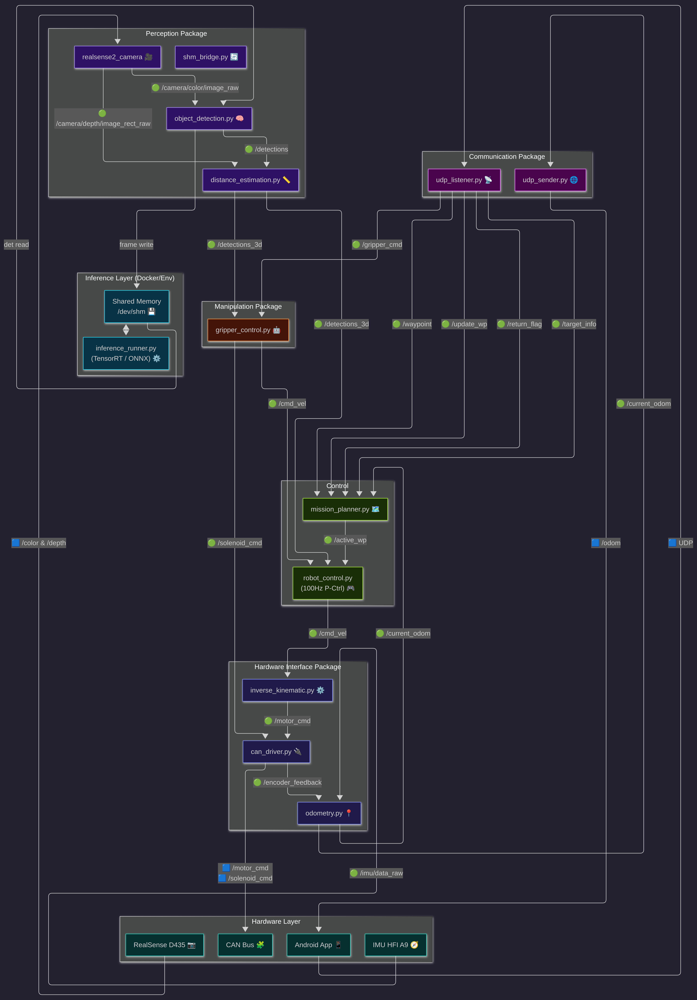

# System Architecture - Target_Setter_v2.0

## System Diagram



Last updated: 2026-05-08 (v2.0)

## Packages and Nodes

``` bash
.
├── communication
│   ├── communication
│   │   ├── __init__.py
│   │   ├── udp_listener.py
│   │   └── udp_sender.py
│   ├── LICENSE
│   ├── package.xml
│   ├── resource
│   │   └── communication
│   ├── setup.cfg
│   ├── setup.py
│   └── test
│       ├── test_copyright.py
│       ├── test_flake8.py
│       └── test_pep257.py
├── control
│   ├── control
│   │   ├── __init__.py
│   │   └── robot_control.py
│   ├── LICENSE
│   ├── package.xml
│   ├── resource
│   │   └── control
│   ├── setup.cfg
│   ├── setup.py
│   └── test
│       ├── test_copyright.py
│       ├── test_flake8.py
│       └── test_pep257.py
├── hardware_interface
│   ├── hardware_interface
│   │   ├── can_driver.py
│   │   ├── hfi_a9.py
│   │   ├── __init__.py
│   │   ├── inverse_kinematic.py
│   │   └── odometry.py
│   ├── LICENSE
│   ├── package.xml
│   ├── resource
│   │   └── hardware_interface
│   ├── setup.cfg
│   ├── setup.py
│   └── test
│       ├── test_copyright.py
│       ├── test_flake8.py
│       └── test_pep257.py
├── manipulation
│   ├── LICENSE
│   ├── manipulation
│   │   ├── gripper_control.py
│   │   └── __init__.py
│   ├── package.xml
│   ├── resource
│   │   └── manipulation
│   ├── setup.cfg
│   ├── setup.py
│   └── test
│       ├── test_copyright.py
│       ├── test_flake8.py
│       └── test_pep257.py
├── navigation
│   ├── LICENSE
│   ├── navigation
│   │   ├── __init__.py
│   │   └── mission_planner.py
│   ├── package.xml
│   ├── resource
│   │   └── navigation
│   ├── setup.cfg
│   ├── setup.py
│   └── test
│       ├── test_copyright.py
│       ├── test_flake8.py
│       └── test_pep257.py
├── perception
│   ├── LICENSE
│   ├── package.xml
│   ├── perception
│   │   ├── distance_estimation.py
│   │   ├── inference_runner.py
│   │   ├── __init__.py
│   │   ├── object_detection.py
│   │   └── shm_bridge.py
│   ├── resource
│   │   └── perception
│   ├── setup.cfg
│   ├── setup.py
│   └── test
│       ├── test_copyright.py
│       ├── test_flake8.py
│       └── test_pep257.py
├── robot_interface
│   ├── CMakeLists.txt
│   ├── include
│   │   └── robot_interface
│   ├── LICENSE
│   ├── msg
│   │   ├── DetectionArray.msg
│   │   └── Detection.msg
│   ├── package.xml
│   └── src
└── target_setter
    ├── launch
    │   └── target_setter.launch.py
    ├── LICENSE
    ├── package.xml
    ├── resource
    │   └── target_setter
    ├── setup.cfg
    ├── setup.py
    ├── target_setter
    │   └── __init__.py
    └── test
        ├── test_copyright.py
        ├── test_flake8.py
        └── test_pep257.py

34 directories, 82 files
```

## TS-Link Communication

All TS-Link UDP communication runs between the Android app and the robot over Wi-Fi on port `5050`.

Protocol documentation:

- **[ts_link_v2.0](ts_link_v2.0.md)** — current wire format (v2)
- **[ts_link_v1.0](ts_link_v1.0.md)** — legacy format (v1.0, superseded)

### App → Robot

| Packet          | ROS topic      | Description                        |
|-----------------|----------------|------------------------------------|
| HELLO           | —              | Session handshake                  |
| WAYPOINT_BATCH  | `/waypoint`    | Ordered list of waypoints          |
| UPDATE_WAYPOINT | `/update_wp`   | Edit a waypoint by index           |
| RETURN          | `/return_flag` | Return to last visited waypoint    |
| ESTOP           | `/estop`       | Emergency stop                     |
| GRIPPER         | `/gripper_cmd` | Open/close gripper command         |
| HEARTBEAT       | —              | Keepalive                          |
| GOODBYE         | —              | Clean session termination          |

### Robot → App

| Packet    | ROS topic        | Description                        |
|-----------|------------------|------------------------------------|
| HELLO     | —                | Session ID + status response       |
| ODOMETRY  | `/current_odom`  | Position at ~10Hz                  |
| STATUS    | —                | State machine + active waypoint    |
| HEARTBEAT | —                | Keepalive response                 |
| GOODBYE   | —                | Session termination acknowledgement|

## Interfaces Definitions

### ROS2 Topics

| Topic | Type | Publisher | Subscriber | Description |
|-------|------|-----------|------------|-------------|
| `/camera/color/image_raw` | `sensor_msgs/msg/Image` | realsense2_camera | object_detection | RGB frame |
| `/camera/depth/image_rect_raw` | `sensor_msgs/msg/Image` | realsense2_camera | distance_estimation | Aligned depth frame (uint16, mm) |
| `/detections` | `robot_interface/msg/DetectionArray` | object_detection | distance_estimation | 2D bounding boxes, no distance |
| `/detections_3d` | `robot_interface/msg/DetectionArray` | distance_estimation | robot_control, gripper_control | Detections with distance filled |
| `/imu/data_raw` | `sensor_msgs/msg/Imu` | hfi_a9 | odometry | Raw IMU orientation + angular velocity |
| `/encoder_feedback` | `robot_interface/msg/EncoderFeedback` | can_driver | odometry | Wheel encoder speed + position |
| `/current_odom` | `nav_msgs/msg/Odometry` | odometry | mission_planner, udp_sender | Robot pose (x, y, yaw) |
| `/waypoint` | `robot_interface/msg/WaypointBatch` | udp_listener | mission_planner | Ordered waypoint list |
| `/update_wp` | `robot_interface/msg/UpdateWaypoint` | udp_listener | mission_planner | In-motion waypoint edit |
| `/return_flag` | `robot_interface/msg/Return` | udp_listener | mission_planner | Return to last waypoint |
| `/estop` | `robot_interface/msg/Estop` | udp_listener | robot_control | Emergency stop trigger |
| `/target_info` | `robot_interface/msg/TargetSetter` | udp_listener | mission_planner | Target metadata |
| `/gripper_cmd` | `robot_interface/msg/GripperCmd` | udp_listener | gripper_control | Open/close trigger |
| `/active_wp` | `robot_interface/msg/Waypoint` | mission_planner | robot_control | Current active waypoint |
| `/cmd_vel` | `geometry_msgs/msg/Twist` | robot_control, gripper_control | inverse_kinematic | Velocity command (vx, vy, wz) |
| `/motor_cmd` | `robot_interface/msg/MotorCommand` | inverse_kinematic | can_driver | Per-wheel speed commands |
| `/solenoid_cmd` | `robot_interface/msg/SolenoidCommand` | gripper_control | can_driver | Gripper open/close signal |

### Messages

#### `robot_interface`

##### `robot_interface/msg/Detection.msg`

``` bash
std_msgs/Header header
float32 x1
float32 y1
float32 x2
float32 y2
float32 cx
float32 cy
float32 confidence
string class_name
float32 distance
bool valid
```

##### `robot_interface/msg/DetectionArray.msg`

``` bash
std_msgs/Header header
Detection[] detections
```

##### `robot_interface/msg/GripperCmd.msg`

``` bash
bool open    # true = open, false = close
```

##### `robot_interface/msg/Waypoint`

``` bash
uint32 index
uint32 version
float64 x
float64 y
```

##### `robot_interface/msg/WaypointBatch`

``` bash
uint32 version
Waypoint[] waypoint
```

##### `robot_interface/msg/UpdateWaypoint`

``` bash
bool edited
uint32 index
uint32 version
float64 x
float64 y
```

##### `robot_interface/msg/Return`

``` bash
bool flag
```

##### `robot_interface/msg/Estop`

``` bash
bool estop
```

##### `robot_interface/msg/TargetSetter`

``` bash
string ip 
uint16 port
```

##### `robot_interface/msg/EncoderFeedback`

``` bash
uint16 can_id
float32 speed
float32 position
```

##### `robot_interface/msg/MotorCommand`

``` bash
uint16 can_id
float32 goal
bool positionmode
bool speedmode
bool voltagemode
bool stop
bool reset
```

##### `robot_interface/msg/DigitalAndSolenoidCommand`

``` bash
uint16 can_id

bool digital1_value
bool digital2_value
bool digital3_value
bool digital4_value

bool solenoid1_value
bool solenoid2_value
bool solenoid3_value
bool solenoid4_value
bool solenoid5_value
bool solenoid6_value
```

##### `robot_interface/msg/ActiveWaypoint`

``` bash
float64 x
float64 y 
float64 yaw
```

#### `sensor_msgs`

##### `sensor_msgs/msg/Image`

``` bash
std_msgs/Header header
uint32 height
uint32 width
string encoding
uint8 is_bigendian
uint32 step
uint8[] data
```

##### `sensor_msgs/msg/Imu`

``` bash
std_msgs/Header header
geometry_msgs/Quaternion orientation
float64[9] orientation_covariance
geometry_msgs/Vector3 angular_velocity
float64[9] angular_velocity_covariance
geometry_msgs/Vector3 linear_acceleration
float64[9] linear_acceleration_covariance
```

##### `sensor_msgs/msg/MagneticField`

``` bash
std_msgs/Header header
geometry_msgs/Vector3 magnetic_field
float64[9] magnetic_field_covariance
```

#### `nav_msgs`

##### `nav_msgs/msg/Odometry`

``` bash
std_msgs/Header header
string child_frame_id
geometry_msgs/PoseWithCovariance pose
geometry_msgs/TwistWithCovariance twist
```

#### `geometry_msgs`

##### `geometry_msgs/msg/Twist`

``` bash
geometry_msgs/Vector3 linear
geometry_msgs/Vector3 angular
```

##### `geometry_msgs/msg/Quaternion`

``` bash
float64 x
float64 y
float64 z
float64 w
```

##### `geometry_msgs/msg/Vector3Stamped`

``` bash
std_msgs/Header header
geometry_msgs/Vector3 vector
```

### Services

#### `std_srvs`

##### `std_srvs/srv/Trigger`

``` bash
boolean success
string message
```

## State Machine Definitions

### robot_control.py

``` bash
IDLE
  → receives waypoints              → NAVIGATE
  → return requested, history exists → RETURN

NAVIGATE
  → waypoint reached                → PAUSED
  → ball within HANDOFF_THRESHOLD   → stops publishing /cmd_vel
                                       (gripper_control takes over)

PAUSED
  → pause duration elapsed          → IDLE
  → external pause (pause())        → stays PAUSED until resume()

RETURN
  → return waypoint reached         → PAUSED
```

### gripper_control.py

``` bash
IDLE
  → /gripper_cmd open received      → OPEN_GRIPPER

OPEN_GRIPPER
  → ball detected in /detections_3d
    AND distance < HANDOFF_THRESHOLD → CORRECT_POSITION
  → no ball detected                → IDLE (open only, drop off mode)

CORRECT_POSITION
  → visual servo: error_x, error_y, distance
  → aligned AND distance < GRAB_DISTANCE → CLOSE_GRIPPER
  → ball lost                       → CLOSE_GRIPPER

CLOSE_GRIPPER
  → solenoid close command sent     → IDLE
```

### mission_planner.py

``` bash
IDLE
  → /waypoint received              → dispatches to robot_control

PLANNING
  → manages waypoint queue
  → handles /update_wp edits
  → handles /return_flag
  → publishes /active_wp to robot_control
```

## Theory and Constraints
