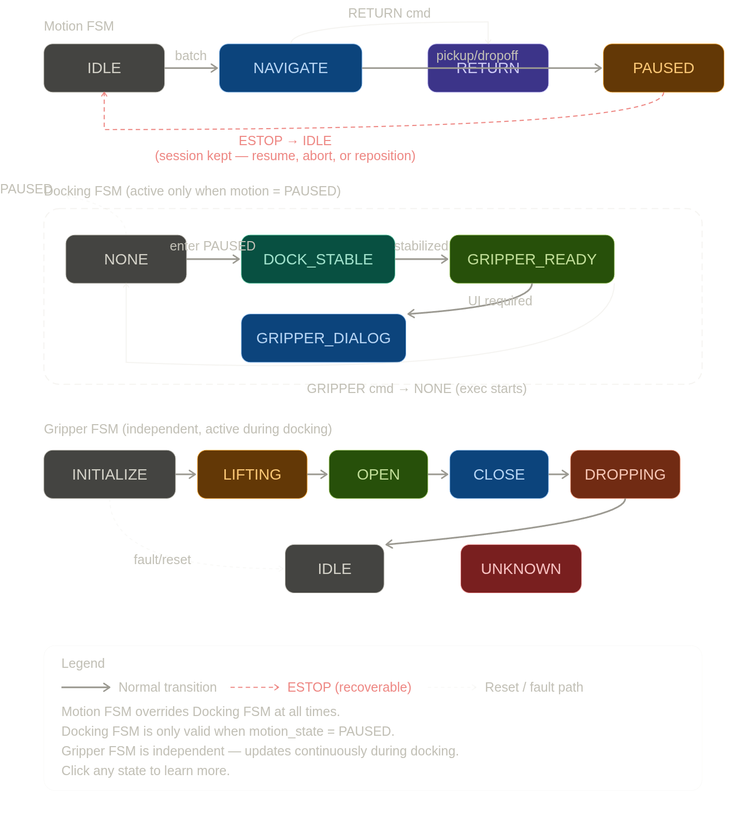

# TS-Link Protocol v2.0 — Robot Finite State Machine (FSM)

This document defines the **authoritative execution state machine** for the TS-Link v2.0 robot system.

The robot uses a **hierarchical FSM model** consisting of:

* Motion FSM (global behavior)
* Docking FSM (fine-grained manipulation control)
* Gripper FSM (execution feedback state)



## Motion FSM

The Motion FSM controls navigation, idle behavior, return mode, and docking entry.

### States

| State    | Code | Description                    |
| -------- | ---- | ------------------------------ |
| IDLE     | 0x00 | Robot is inactive or waiting   |
| NAVIGATE | 0x01 | Executing waypoint plan        |
| RETURN   | 0x02 | Returning through visited path |
| PAUSED   | 0x03 | Temporary halt for docking     |
| FAULT    | 0x04 | Fault condition (navigation/estop)

### Motion Transitions

| Event                             | From     | To       |
| --------------------------------- | -------- | -------- |
| HELLO success                     | ANY      | IDLE     |
| WAYPOINT_BATCH received           | IDLE     | NAVIGATE |
| waypoint reached (PICKUP/DROPOFF) | NAVIGATE | PAUSED   |
| RETURN command                    | ANY      | RETURN   |
| ESTOP                             | ANY      | IDLE     |
| GOODBYE                           | ANY      | IDLE     |

## Docking FSM (Manipulation Layer)

Docking FSM is active only when Motion FSM is in **PAUSED** state.

### Activation Rule

``` bash
Docking FSM active if:
motion_state == PAUSED
```

### Docking States

| State          | Code | Description                                      |
| -------------- | ---- | ------------------------------------------------ |
| NONE           | 0x00 | No docking active                                |
| DOCK_STABLE    | 0x04 | Robot aligned and stable                         |
| GRIPPER_READY  | 0x05 | Safe to trigger gripper interaction              |

> Note: `GRIPPER_DIALOG` is not implemented in the current `mission_planner.py` DockingState enum; docking is represented by `DOCK_STABLE` and `GRIPPER_READY` only.

> Note: EXECUTING is not exposed externally; it is covered by GRIPPER_STATE.

### Docking Transitions

| Event                    | From          | To                 |
| ------------------------ | ------------- | ------------------ |
| Enter PAUSED             | ANY           | DOCK_STABLE        |
| pose stabilized          | DOCK_STABLE   | GRIPPER_READY      |
| UI interaction required  | GRIPPER_READY | GRIPPER_DIALOG     |
| GRIPPER command received | GRIPPER_READY | NONE (exec starts) |
| exit PAUSED              | ANY           | NONE               |

## Gripper FSM

This FSM reflects the **real-time gripper status shown in the app UI**.

### States

| State      | Code | Description           |
| ---------- | ---- | --------------------- |
| INITIALIZE | 0x00 | Starting up / reset   |
| MOVING     | 0x01 | Mechanical move/act   |
| OPEN       | 0x02 | Gripper open          |
| CLOSE      | 0x03 | Gripper closed        |
| IDLE       | 0x04 | Stable idle state     |
| UNKNOWN    | 0x05 | Fault / undefined     |

## State Interaction Rules

### Rule 1 — Hierarchy

* Motion FSM ALWAYS overrides Docking FSM
* Docking FSM only valid when `motion_state == PAUSED`
* Gripper FSM is independent but only meaningful during docking

### Rule 2 — Docking Isolation

Docking states MUST NOT:

* trigger navigation changes
* modify waypoint execution
* reset session state

### Rule 3 — Gripper Behavior

* Gripper execution is an **event-driven FSM**
* It is not part of motion or docking state
* It updates continuously during execution

After completion:

* Docking FSM resets to NONE
* Motion FSM resumes automatically
  
## STATUS Packet Mapping

| Field           | Source      |
| --------------- | ----------- |
| motion_state    | Motion FSM  |
| dock_state      | Docking FSM |
| gripper_state   | Gripper FSM |
| active_wp_index | Planner     |
| remaining_count | Planner     |

## Design Principle

> The robot is the source of truth.
> The app is a reactive observer of STATUS.

This ensures:

* deterministic execution
* predictable UI updates
* safe gripper interaction timing

## Common Execution Flow

### Example: PICKUP waypoint

``` bash
NAVIGATE
   ↓
PAUSED
   ↓
DOCK_STABLE
   ↓
GRIPPER_READY
   ↓
GRIPPER_DIALOG (UI trigger)
   ↓
GRIPPER EXECUTION (FSM active)
   ↓
IDLE / NAVIGATE / RETURN
```

## Critical Notes

* Docking FSM exists ONLY inside PAUSED
* Motion FSM can interrupt at any time (ESTOP / RETURN)
* STATUS is a snapshot, not an event stream
* Gripper FSM is independent but time-correlated with docking
* App must NOT infer transitions beyond STATUS fields
