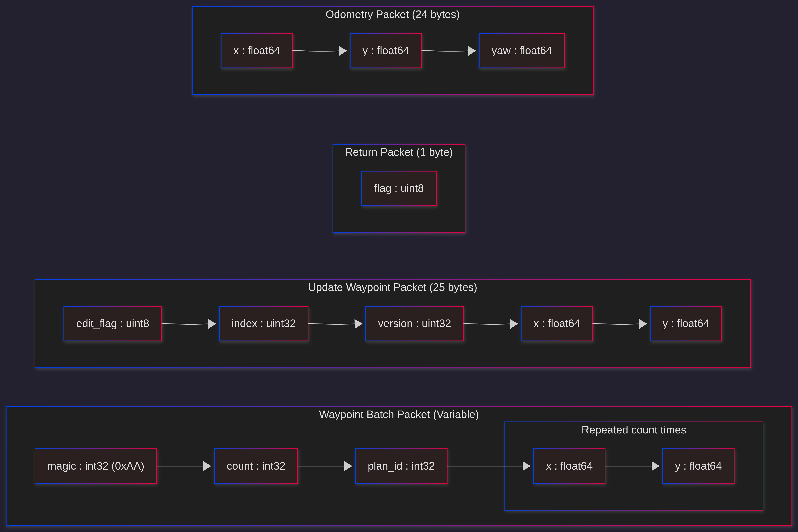

# TS-Link Protocol v1.0

> **Superseded by [ts_link_v2.0](ts_link_v2.0.md).** Documented for reference only. Do not extend.

Implemented in `udp_listener/udp_listener.py`.

## Overview



No handshake, no session, no header. Packets are identified purely by length.
Control is locked to the first IP that sends a valid packet. Lock releases
after 900s of inactivity (with a warning at 780s).

Byte order is little-endian throughout.

## Packet Identification (by length)

| Length    | Type            | Description                     |
|-----------|-----------------|---------------------------------|
| 1 byte    | RETURN          | Single bool flag                |
| 25 bytes  | UPDATE_WAYPOINT | Edit a waypoint by index        |
| ≥12 bytes | WAYPOINT_BATCH  | Waypoint list with magic header |
| other     | Unknown         | Logged and dropped              |

## Packets

### RETURN (1 byte)

``` bash
data[0] : uint8   bool flag (0 = no-op, 1 = return)
```

### UPDATE_WAYPOINT (25 bytes)

``` bash
data[0]    : uint8    edited flag
data[1:5]  : uint32   index    (little-endian)
data[5:9]  : uint32   version  (little-endian) — received but ignored in v1.1
data[9:17] : float64  x        (little-endian)
data[17:25]: float64  y        (little-endian)
```

> **Known bug:** `version` is parsed and logged but never used for filtering.
> The edit applies unconditionally if `edited == True`. This was the root cause
> of the v1.1 edit failure — on app restart the version counter reset to 0,
> but the ROS node's internal version was already at 7, so `msg.version >= wp['version']`
> failed and edits were silently dropped. Fixed in v2 by replacing version
> with a per-session monotonic `seq`.

### WAYPOINT_BATCH (≥12 bytes)

``` bash
data[0:4]  : int32   magic    must equal 0xAA
data[4:8]  : int32   count    number of waypoints
data[8:12] : int32   plan_id
data[12:]  : float64 pairs    x, y per waypoint (count × 16 bytes)

Total expected length: `12 + count * 16`
```

## Session Management

No explicit handshake. Control is locked to the first sender IP:

- First packet from any IP locks control and publishes `/target_info`
- Packets from other IPs are rejected while lock is held
- Lock releases after **900s** of no valid packets
- Warning logged at **780s**
- On release, a `/target_info` with empty IP and port 0 is published to notify other nodes

## Known Limitations

- No session ID — a restarted app on the same IP silently takes over mid-mission
- Version-based edit filtering is broken across restarts (see UPDATE_WAYPOINT bug above)
- No heartbeat — robot has no way to detect app crash, only inactivity timeout
- No ESTOP packet — emergency stop requires app to send RETURN and rely on
  the robot reaching a waypoint
- Little-endian only — inconsistent with standard network byte order
- Packet type identified by length — fragile, no magic byte on RETURN or UPDATE_WAYPOINT
- No outgoing packets beyond ODOMETRY — robot state is invisible to the app
