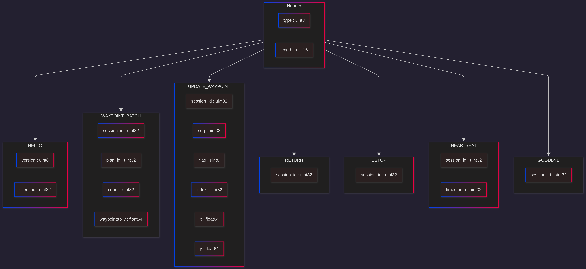
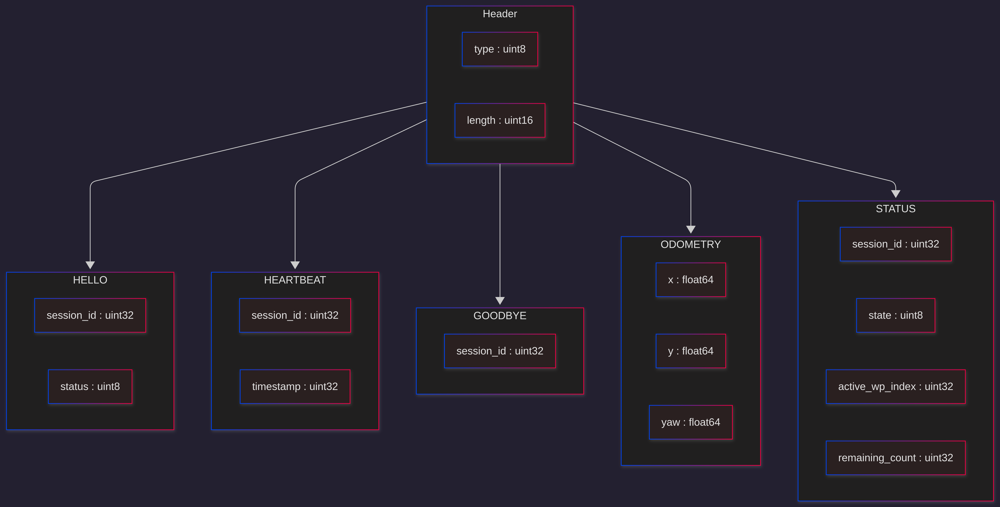

# TS-Link Protocol v2.0

## Overview

UDP-based binary protocol between the app (client) and robot (server).
All packets share a common 3-byte header. Byte order is big-endian throughout.

## Header

Prepended to every packet.

| Field  | Type   | Description                               |
|--------|--------|-------------------------------------------|
| type   | uint8  | Packet type ID                            |
| length | uint16 | Payload length in bytes (excludes header) |

## Packet Type IDs

| ID   | Name             | Direction     |
|------|------------------|---------------|
| 0x01 | HELLO            | App → Robot   |
| 0x02 | HELLO (response) | Robot → App   |
| 0x03 | WAYPOINT_BATCH   | App → Robot   |
| 0x04 | UPDATE_WAYPOINT  | App → Robot   |
| 0x05 | RETURN           | App → Robot   |
| 0x06 | ESTOP            | App → Robot   |
| 0x07 | HEARTBEAT        | Bidirectional |
| 0x08 | GOODBYE          | Bidirectional |
| 0x09 | ODOMETRY         | Robot → App   |
| 0x0A | STATUS           | Robot → App   |

## Status Codes

Used in HELLO response field.

| Code | Meaning                                |
|------|----------------------------------------|
| 0x00 | OK                                     |
| 0x01 | Reject (bad session, malformed packet) |
| 0x02 | Out of bounds (index exceeds plan size)|
| 0x03 | Stale (seq out of order)               |

## Robot State Codes

Used in the STATUS packet.

| Code | State    |
|------|----------|
| 0x00 | IDLE     |
| 0x01 | NAVIGATE |
| 0x02 | RETURN   |
| 0x03 | PAUSED   |

## Packets — App → Robot

### HELLO

Initiates a session. App retries until a HELLO response is received.

| Field     | Type   | Description           |
|-----------|--------|-----------------------|
| version   | uint8  | Protocol version      |
| client_id | uint32 | Unique app identifier |

### WAYPOINT_BATCH

Sends a full navigation plan. Replaces any existing plan.

| Field     | Type        | Description                          |
|-----------|-------------|--------------------------------------|
| session_id| uint32      | Session ID from HELLO response       |
| plan_id   | uint32      | Unique plan identifier               |
| count     | uint32      | Number of waypoints                  |
| waypoints | float64 × 2 | Interleaved x, y pairs (count pairs) |

### UPDATE_WAYPOINT

Edits a single waypoint in the active plan. Robot discards if seq is stale.

| Field      | Type    | Description                           |
|------------|---------|---------------------------------------|
| session_id | uint32  | Session ID from HELLO response        |
| seq        | uint32  | Monotonic counter, resets per session |
| flag       | uint8   | Reserved for future use               |
| index      | uint32  | Waypoint index within current plan    |
| x          | float64 | New x coordinate                      |
| y          | float64 | New y coordinate                      |

### RETURN

Instructs the robot to navigate back through its visited waypoint history.

| Field      | Type   | Description                    |
|------------|--------|--------------------------------|
| session_id | uint32 | Session ID from HELLO response |

### ESTOP

Emergency stop. Robot halts immediately and transitions to IDLE.
App sends this packet 3–5 times in rapid succession — no acknowledgement.

| Field      | Type   | Description                    |
|------------|--------|--------------------------------|
| session_id | uint32 | Session ID from HELLO response |

### HEARTBEAT

Keepalive. App sends every ~500ms. Robot transitions to IDLE and stops if
no heartbeat is received within the watchdog timeout.

| Field      | Type   | Description                  |
|------------|--------|------------------------------|
| session_id | uint32 | Session ID from HELLO response |
| timestamp  | uint32 | Sender millisecond timestamp |

### GOODBYE

Clean session termination. Robot invalidates the session on receipt.

| Field      | Type   | Description                    |
|------------|--------|--------------------------------|
| session_id | uint32 | Session ID from HELLO response |

## Packets — Robot → App

### HELLO (response)

Sent in response to a HELLO from the app.

| Field      | Type   | Description                          |
|------------|--------|--------------------------------------|
| session_id | uint32 | Assigned session ID for this session |
| status     | uint8  | 0x00 = OK, 0x01 = Reject             |

### ODOMETRY

Streamed continuously at ~10Hz.

| Field | Type    | Description             |
|-------|---------|-------------------------|
| x     | float64 | Robot x position (m)    |
| y     | float64 | Robot y position (m)    |
| yaw   | float64 | Robot heading (radians) |

### STATUS

Streamed continuously at ~10Hz. App uses this to detect edit success,
plan progress, and state changes.

| Field           | Type   | Description                          |
|-----------------|--------|--------------------------------------|
| session_id      | uint32 | Current session ID                   |
| state           | uint8  | Current state machine state          |
| active_wp_index | uint32 | Index of waypoint currently targeted |
| remaining_count | uint32 | Waypoints remaining in plan          |

### HEARTBEAT

Keepalive response. App shows disconnected state if this stops arriving.

| Field      | Type   | Description                  |
|------------|--------|------------------------------|
| session_id | uint32 | Current session ID           |
| timestamp  | uint32 | Sender millisecond timestamp |

### GOODBYE

Acknowledgement of app GOODBYE, or robot-initiated clean shutdown.

| Field      | Type   | Description        |
|------------|--------|--------------------|
| session_id | uint32 | Current session ID |

## Session Lifecycle

1. App sends HELLO (retries until response received)
2. Robot replies with HELLO response carrying `session_id`
3. All subsequent packets from app include `session_id`
4. Robot silently drops any packet with a mismatched `session_id`
5. Either side sends GOODBYE to terminate cleanly
6. On app restart: new HELLO → new `session_id` → robot resets `seq` counter

## Edit Reliability

UPDATE_WAYPOINT is fire-and-forget over UDP. The app detects success by
watching `STATUS.active_wp_index` — no explicit ack. On timeout, resend
with the same `seq`. Robot uses `seq` to reject duplicates.

## ESTOP Behaviour

On ESTOP receipt the robot:

1. Publishes zero velocity immediately
2. Clears the active waypoint and plan
3. Transitions to IDLE
4. Keeps the session alive — app can send a new WAYPOINT_BATCH to resume

## Migration from v1

See [ts_link_v1.0](ts_link_v1.0.md) for the legacy wire format and known limitations.
Key breaking changes:

- Big-endian (v2) vs little-endian (v1)
- Explicit 3-byte header on all packets
- Session handshake required before any other packet
- `version` field replaced by per-session monotonic `seq`
- Heartbeat replaces 900s inactivity timeout
- STATUS and ODOMETRY replace silent robot state